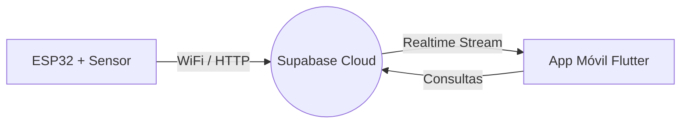

# 🐾 CEREFAS - Monitor Ambiental Inteligente para Fauna Silvestre

Este proyecto es una solución integral de **IoT (Internet of Things)** diseñada para la organización **CEREFAS**. Su objetivo es monitorear en tiempo real las condiciones climáticas (temperatura y humedad) de las jaulas de animales en proceso de rehabilitación, asegurando un entorno óptimo para su recuperación.

## 🚀 El Sistema en un Vistazo

El proyecto integra tres pilares tecnológicos fundamentales:
1. **Hardware (ESP32 + DHT11/22):** Captura de datos ambientales y envío mediante protocolos seguros.
2. **Backend (Supabase):** Base de Datos como Servicio (BaaS) que almacena el historial y gestiona datos en tiempo real.
3. **Frontend (Flutter):** Aplicación móvil multiplataforma que visualiza datos y genera alertas críticas.

## 🏗️ Arquitectura de la Solución

## 📂 Estructura del Repositorio
Para facilitar el desarrollo y la colaboración, el código se divide en dos módulos principales:

- **flutter_app:** Contiene el código fuente de la aplicación móvil desarrollada con Flutter. Incluye la lógica de conexión a Supabase, gestión de estados y diseño de interfaz Material Design 3.

- **esp32_hardware:** Scripts en MicroPython para la placa ESP32. Incluye el manejo del sensor, la lógica de conexión WiFi y el envío de datos a la nube mediante el archivo de configuración segura.

## 🛠️ Requisitos Rápidos
- **Hardware:** Placa ESP32, Sensor DHT11 o DHT22, cables jumper y fuente de alimentación.

- **Software:** Flutter SDK (>= 3.0), entorno de ejecución MicroPython (Thonny recomendado).

- **Servicios:** Proyecto configurado en Supabase con tablas para almacenamiento de sensores.

## 🔐 Seguridad y Configuración
Este repositorio utiliza una política estricta de seguridad para proteger las credenciales:

- Los archivos que contienen claves reales (`secrets.py` en hardware y configuraciones locales en Flutter) están excluidos mediante el archivo `.gitignore`.

- **Instalación:** Para configurar el proyecto por primera vez, utiliza los archivos de plantilla como `secrets_example.py` dentro de la carpeta de hardware, renómbralos a `.py` y completa tus datos.

## 👥 Equipo
Proyecto desarrollado por alumnos de la **Universidad San Sebastián** en apoyo a la organización **CEREFAS**.
